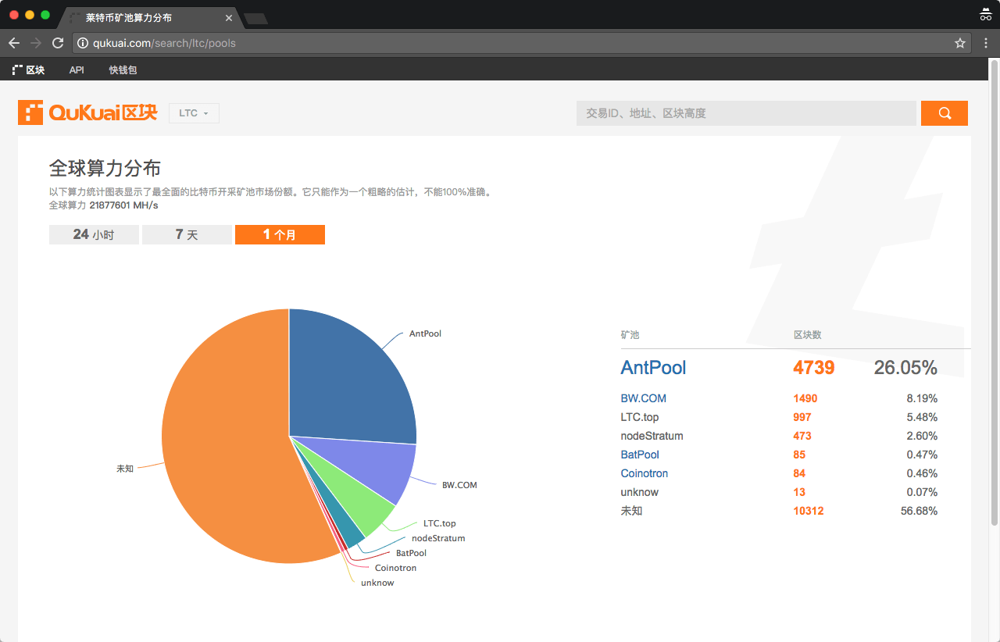
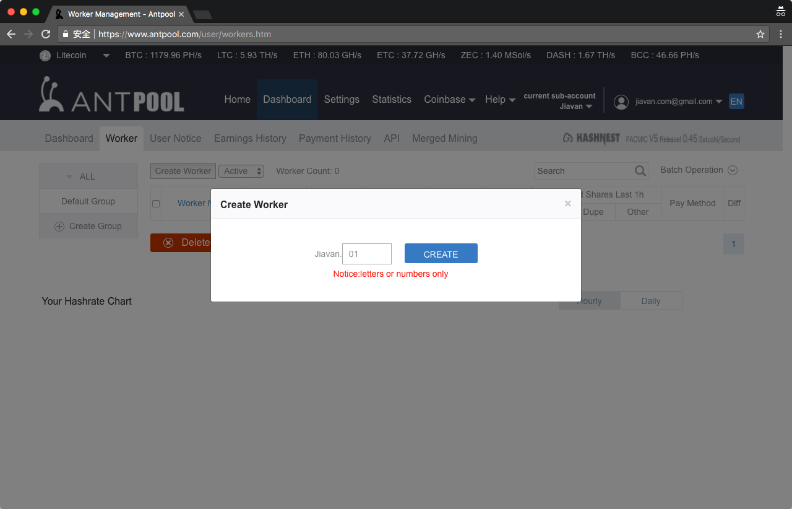
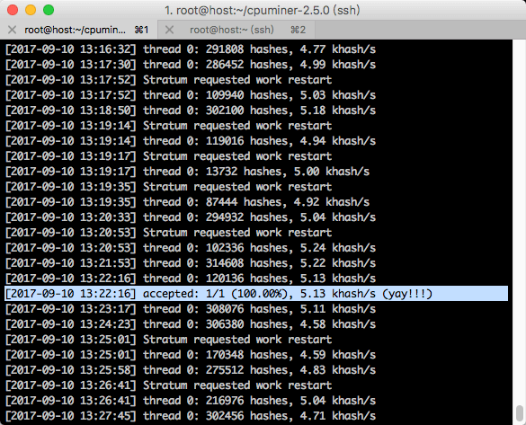
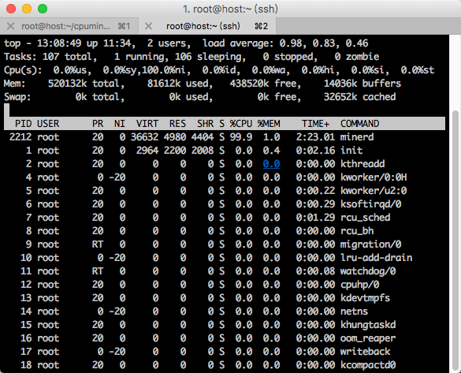
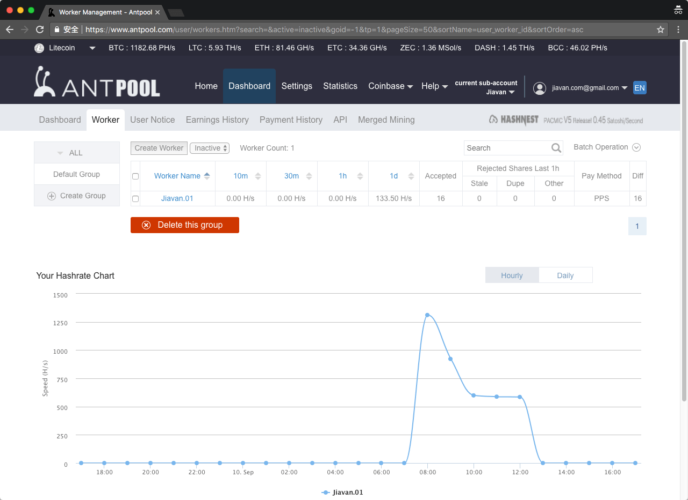
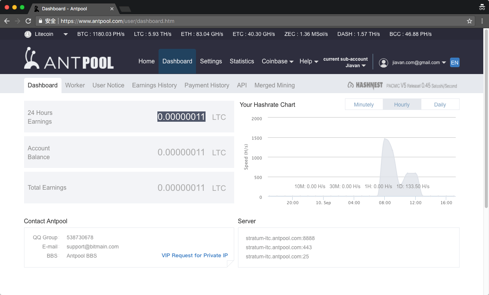

前段时间疯狂的`WannaCry`蠕虫病毒再一次将比特币带入大众视野，导致最近挖矿的人越来越多，AMD 显卡甚至都脱销还出现了专门的矿机。之前也还没有写过关于区块链技术的博客，后面打算有时间写两篇文章来介绍一下我对区块链技术的认识以及与比特币相关的一些东西。本文主要介绍了挖矿的概念，以及如何利用普通服务器的 CPU 来实现莱特币挖矿。


<!--more-->

## 什么是挖矿
这里的挖矿不是挖煤，最早的 P2P 货币挖矿当然是出现在比特币中，如果还不知道什么是比特币的可以先看看[这里](https://en.wikipedia.org/wiki/Bitcoin)。比特币包括其他山寨币的产生主要就是通过挖矿，对比特币有基础了解的都应该知道比特币的数量是有限的。其固定的总和不会超过 2100 万个，其实最开始在比特币网络中的比特币只有少数的，就是通过不断的挖矿来产生这些币，也就是说挖矿说得更加 official 的一种称法是“比特币的一次发行”。

在比特币网络中的每一次交易都需要被记录下来，那么谁来记录这些交易，将这些交易信息打包成一个区块放入比特币网络中那么他就会获得比特币奖励。这个过程中做这件事情的机器(可能是服务器、PC、矿机)就被称为`矿工`，那么矿工做这件事情的过程就被称为`挖矿`,每一次成功`挖矿`的背后就对应了一次比特币的发行，即对应了对`矿工`做这件事情的奖励。那么新的问题是，打包交易信息生成区块这种事情很简单，任何电脑都可以做，那么对于这么多的矿工，应该把这件事情交给谁来做？

其实单纯的生成一个区块这种事情是很简单的，但是比特币对区块编号格式具有严格的要求，所以不是任何区块编号都能满足编号格式要求。生成一个区块编号的大致步骤如下：

```
blcokX
######
交易 A
交易 B
交易 C
...
上一个区块编号: xxxxxx...
######

上面是一个区块的大致格式，现在要生成一个新的区块编号block_id:
block_id = hash(blockX);
```

即对交易内容做一次哈希计算就能得到一个hash值，这个值就对应了这个区块的区块编号，但是这样是不符合比特币区块编号格式的。比特币网络一般会要求生成的hash值的前n位为必须全是0，这个n是通过对全网的算力评估来进行调整的。比如：

```
00000000000000000005c679447164d75f6843b25d6cb89a5a3e1fce03d322a2
```

这个hash块就是比特币网络中一个合法的块，也是一个真实的块。我们知道对一个固定内容的信息取hash输出也一定是固定值，但是要获得不同的输出以满足前n位为0的要求，只能改变输入，但是又不能改变交易内容。所以在一个区块信息中会存在一个`幸运数字`来提供给矿工变更，矿工不断的更换这个值来做hash计算来获得不同的hash值，然后判断自己的计算是不是满足区块编号的格式要求。出现一位0的概率是`2^4`如果是10位，那么就可能存在`2^40`次hash计算。那么这`2^40`hash计算也对应了该矿工的工作证明，他成功的找到满足编号要求的值，所以挖矿大部分工作就是在不停的做hash计算...所以生成合法编号是需要一定的计算成本，计算速度就能影响到你是否能快速的找到这个合法编号。

## 挖矿的现状
在比特币历史上的第一次挖矿是比特币作者`中本聪`在自己电脑上挖出来的，现在来看用 PC 挖矿基本是不现实的，回顾挖矿历史已经经历了下面这些时代：

```
CPU（20MHash/s）→
GPU（400MHash/s）→
FPGA（25GHash/s）→
ASIC（3.5THash/s）→
大规模集群挖矿（3.5THash/s*X）
```

在挖矿中有一个术语被称为`算力(hash/s)`，顾名思义即为计算能力，这里的能力指的是每秒能做多少次hash计算，上面我们已经提到挖矿的主要工作就是不停的做hash计算，所以算力越大代表挖矿成功率越高。到目前为止比特币的全网算力大约在`7124520 TH/s`可以超过世界上所有超级计算机加起来算力的总和，想想每天有那么多机器在做这些无聊的hash计算浪费电就觉得恐怖...

用我们的破笔记本去挖矿实现一个小目标的梦想是肯定行不通了，所以出现了`矿池`这种东西，也就是将计算任务分担出去给不同的机器，这里矿池并不会关心你是一个超级计算器还是矿机还是一个笔记本。这样矿池整体的算力就可能会变得很强大，每个人都能挖到矿也成为了可能，这样整个矿池就可以根具你算计的贡献程度来平分挖矿所得。

## CPU挖矿
下面我们将会使用一个VPS来进行挖矿，因为服务器是没有显卡的所以我们只能通过CPU来进行挖矿。我们挖矿的对象是`莱特币`以前被认为是山寨的比特币，目前价值在$85一枚，现在已经有了比特金莱特银这种说法，比特币实在是太难挖所以我们选择一个稍微能看到成效的币种。

### 1 选择一个矿池

根据上图不知道可靠不可靠的信息可以看出，目前`AntPool`矿池是算力最强的，我们也选择加入这个矿池去AntPool.com注册一个账号。

### 2 下载编译挖矿程序
这里我们使用一个开源的CPU挖矿程序[https://github.com/pooler/cpuminer](https://github.com/pooler/cpuminer)，他可以挖比特币以及莱特币。矿工是一个搬瓦工的VPS，配置如下：

```
SSD: 10 GB RAID-10
RAM: 512 MB
CPU: 1x Intel Xeon
Transfer: 500 GB/mo
Link speed: 1 Gigabit
Multiple locations
```

#### 0x00 下载依赖
```shell
# Ubuntu
$ sudo apt-get install make libcurl4-openssl-dev

# centOS
$ sudo yum install gcc make curl-devel
```

#### 0x01 编译
```shell
$ wget https://github.com/pooler/cpuminer/releases/download/v2.5.0/pooler-cpuminer-2.5.0.tar.gz
$ tar xzf pooler-cpuminer-*.tar.gz
$ cd cpuminer-*
$ ./configure CFLAGS="-O3"
$ make
```

### 3 创建一个矿工


### 4 连接矿池
```shell
$ ./minerd -o stratum+tcp://stratum-ltc.antpool.com:8888 -u Jiavan.01 -p 1234
```

连接矿池的地址以及输入矿工的名字，密码是一个可选项，因为矿池只需要知道是谁在给他工作就行了，不需要确认这个人是不是本人，所以只要矿工名字对了就ok了，没有人傻到帮别人工作还把自己的银行卡账号说成其他人的吧。

### 5 开始挖矿

连接上矿池后我们就开始做hash计算，可以看出我们这个CPU好像不是很给力啊只有5khash/s.


看看Server的状态，CPU几乎被跑得满满的。

### 6 获得收益

挖了一段时间我们可以看到VPS在不同时间段为矿池分担的算力。


通过过去几个小时的挖矿我们获得了 `0.00000011` 个莱特币，兑换成人命币大约是 `￥0.0000498806` 也就是说按照我现在这个VPS的CPU算力挖到价值一元的莱特币需要 `9.2814232981` 年的时间。以前听说用CPU挖矿的人电费都交不起，现在来看已经不仅仅是交不起电费的问题了...

---
如果你觉得这个博客对你有所帮助，可以给博主捐赠。

- Bitcoin: 1N3ZHuPTAPFePgTWWTYAyZ1MSzdoAXnQtw
- Litecoin: Lh4ULyR5iWBNCiJj8apfejX8gCE1UsB6sJ
- Dogecoin: DTPi4nXQtmLJPWoTdE9SPVmWwLhjhQ2JpL


参考文章：

- https://bitcointalk.org/index.php?topic=55038.0
- https://www.zhihu.com/question/20792042
