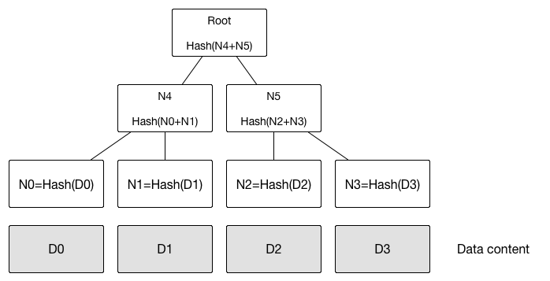

### 地址
私钥由 32 字节随机数组成，通过私钥可以计算出公钥，公钥通过一系列 hash 和编码（Base58，避免书写混淆如I和L）可以得到比特币地址，可以简单的将地址理解为公钥的摘要。
```
# 比特币使用了椭圆曲线签名算法
私钥 => 公钥 => 比特币地址
```
### 区块结构

区块 hash 值计算其实不会包含区块体，打包时只有区块头被用于计算 hash，常说的区块 hash 其实是区块头的 hash，他可以用来标识一个区块。
区块头是 80 个字节，而平均每个区块包含 2500 左右个交易，所以完整的交易信息比区块头会大很多。

### Merkle 树
在了解 Merkle 树之前我们先了解`零知识证明`。
> 证明者在不向验证者提供任何有用信息的前提下，使验证者相信某个论断是正确的。
例如，A 向 B 证明自己有一个物品，但 B 无法拿到这个物品，B 无法用 A 的证明去向别人证明自己也拥有这个物品。


默克尔树的特点是任何底层数据的变化都会传递到其父节点，一直到树根。

默克尔树的经典应用场景：
- 快速比较大量数据，当两个默克尔树树根相同时，则意味着所代表的数据必然相同。
- 快速定位修改，如果 D0 被修改，会影响到 N0，N4，Root。因此定位修改可以通过 Root -> N4 -> N0 快速定位到 D0 的修改。
- 零知识证明，例如如何证明某个数据中包含 D0，可以直接构建一个 Merkle 树，公布 N0、N1、N4、N5、Root，可以很容易检测到 D0 的存在，但不知道其内容。

每个交易被看成一个数据块，Merkle 树是一种哈希二叉树，这样可以单独拿出一颗子树来对部分数据进行校验。
每个叶子节点是交易信息的哈希，往上的父节点是子节点哈希串拼接之后的再次哈希，直到剩下一个根节点即为 Merkel 树根，树根将会被存入区块头。
Merkle 树需要偶数个叶子节点，所以在出现奇数个交易时，最后一个叶子节点会被复制一份构成偶数个叶子节点。

### SPV
由于不是所有节点都具备储存完整区块信息的能力，更多节点是以 SPV（Simplified Payment Verification 简单支付验证）钱包的方式接入比特币网络。通过 SPV 仅仅保存区块头可以在不拥有完整区块数据的情况下对交易进行验证。
