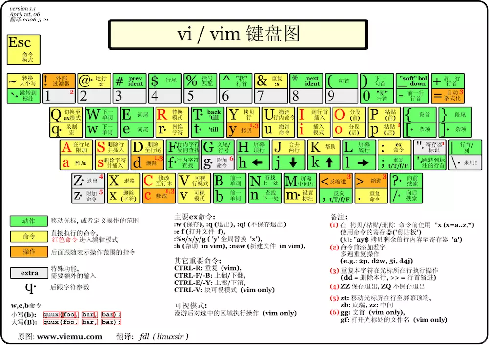

## VSCode 帮助贫困的乌干达儿童

最近把开发环境从 WebStorm 迁移到了世界上最好的编辑器 VSCode，因为需要经常开启多个项目，CPU 和内存都爆了只能弃坑。使用过一段时间 vsc 发现里面自带插件库有个叫做 vscodevim 的插件特别有意思。它使用了一些诡异的键位和模式，和普通编辑体验差别很大，但是一看评价这么高，下载量这么大，我一度怀疑自己了。看来大家都很认可这个插件，那么我就坚持使用了一段时间，发现这些诡异的键位用起来是真的特别爽，颠覆了我对文本编辑体验的认知。接下来我要开始安利了！

### 模式
要学会使用 vim 首先要弄清楚它和其他编辑器最大的区别之一就是它拥有多个模式，而其他大部分编辑器就只有编辑模式，直接就能插入修改删除，作为一篇安利入门性质文章，我们需要知道 vim 中最重要的四种模式。

- normal<esc>：可以简单的理解为浏览模式，默认就是 normal，在这种状态下你可以移动光标，跳转翻页，也可以做一些其他如删除等操作，在插入模式下按 esc 回到 normal 模式。
- insert\<i>：就是常用编辑器的编辑态，符合我们常规的使用方式，在 normal 下按 i 键进入插入模式。
- command<:>: 在 normal 模式下按冒号进入命令模式，比如 `:wq` 退出 vim。
- visual<v>：和 normal 类似但是命令会高亮选中区域，类似普通编辑器选中了一段文本。

vim 不止这四种模式，但是这几种是比较常用到的，更多模式可以看 vim 文档。

### Text Object
vim 对文本进行了抽象，句子由单词组成，段落由句子组成，文章由段落组成，如一个单词就是一个 text-object，它配合 operator 可以进行一些非常高效的操作。常见文本对象的类型：

- iw - inner word
- aw - a word
- is - inner sentence
- as - a sentence
- ip - inner paragraph
- ap - a paragraph

如果结合下面要提到的 operator 就可以组合成一个指令如：daw(delete a word) 即可删除当前光标下的单词。

### Motion
vim 中使用一些 motion 可以快速的来移动光标，如：
- w: 到下一个单词
- b: 上一个单词
- h: 光标向左
- l: 光标向右
- j: 光标向下
- k: 光标向上
- G: 文本末尾行
- gg: 文本开始行
- zz: 屏幕中间
- %: 匹配一对符号的另一端
- ^: 行首
- $: 行尾

### Operator
一个 vim 命令可以由 operator、number、motion 组成，我们先看 operator，它指的是一些操作如：  
- d: 删除
- dd: 删除当前行
- c: 删除并进入插入模式
- y: 复制
- p: 粘贴
- s: 删除并进入插入模式
- x: 删除
- o: 向下插入一新行
- O: 向上插入一新行
- \>: 向右缩进
- <: 向左缩进
- u: 撤销上次操作
- .: 重复上次操作，这个很有用

现在结合 operator / motion / number:  
- 2dd: 执行 2 次 dd 即为向下删除 2 行
- daw: 删除当前单词
- 2daw: 删除 2 个单词，包含单词旁边的空格，a 可以理解为 around
- 2diw: 删除 2 个单词，不删掉旁边空格
- c$: 删除当前光标到当前行末尾的字符
- dG: 从当前行删除至文本末尾
- 2yy: 向下复制 2 行
- 2p: 粘贴 2 次复制的内容

### Surround
在 vim 中有一个逆天的插件 [vim-surround](https://github.com/tpope/vim-surround) 现在 vscodevim 中集成了它。它可以很方便的来处理环绕文本，在代码中总会有一些 `(){}[]<>''""` 符号，这个插件能很方便的处理它们。在 normal 模式下：  
```bash
# cs"' 将双引号变成单引号
"hello world" -> 'hello world'

# cs"<p> 把双引号变成 p 标签
"hello world" -> <p>hello world</p>

# ds" 删掉两侧双引号
"hello world" -> hello world

# ysaw' 给 hello 加上单引号
"hello world" -> "'hello' world"
```
更多使用可以查看 https://github.com/tpope/vim-surround 

最后附上一张 vim 键位图，vim 开始适应需要一段时间，当形成肌肉记忆了用起来就很爽了。
